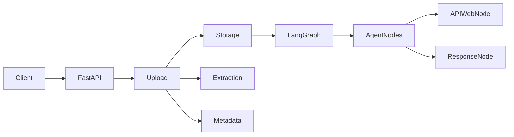

# BTP Use Case: Red Teaming for Privacy of Unstructured Data in Agents

This prototype implements a clean separation between document ingestion and agent orchestration. The goal is to keep a simple, extensible architecture ready for future privacy red-teaming at both the node and graph levels.

## Architecture



## Project purpose

- Ingest unstructured documents through a FastAPI service.
- Store the original artifact without conflating it with extracted text.
- Extract text in a provider-agnostic way.
- Preserve metadata and storage references.
- Orchestrate a LangGraph workflow independently.
- Keep boundaries ready for future privacy auditing, red-teaming, logging, and data-flow analysis.

## Directory structure

- `src/btp_usecase/api` – route and dependency wiring for FastAPI.
- `src/btp_usecase/core` – configuration and logging utilities.
- `src/btp_usecase/models` – domain models and API payloads.
- `src/btp_usecase/services` – document upload, extraction, and metadata logic.
- `src/btp_usecase/storage` – storage abstraction and a local implementation.
- `src/btp_usecase/graph` – explicit LangGraph state and graph construction.
- `tests` – basic tests around upload, extraction, storage, and graph flow.

## Installation

```bash
cd btp_usecase
uv venv
source .venv/bin/activate  # Linux/macOS
# or .venv\Scripts\activate on Windows
uv sync
```

## Environment variables

Copy `.env.example` to `.env` and update values as needed.

```bash
cp .env.example .env
```

Required values:

- `STORAGE_DIRECTORY`
- `MAX_UPLOAD_SIZE_MB`
- `ALLOWED_FILE_TYPES`
- `LLM_PROVIDER`
- `LLM_MODEL`
- `API_KEY` (optional for the prototype)

## Run FastAPI

```bash
uv run uvicorn btp_usecase.main:app --reload
```

Then open:

- `http://localhost:8000/health`
- `http://localhost:8000/docs`

## Upload a document

```bash
curl -X POST "http://localhost:8000/documents/upload" \
  -F "file=@sample.pdf"
```

## Invoke the LangGraph agent

The graph can be invoked from Python directly:

```python
from btp_usecase.graph.graph import build_graph

graph = build_graph()
result = graph.invoke({
    "user_query": "Summarize the uploaded document",
    "document_id": "doc-123",
    "document_text": "This is a sample document for the privacy prototype.",
})
print(result["final_response"])
```

## Component interaction

1. FastAPI receives a multipart file.
2. `DocumentService` validates and stores the raw bytes.
3. The extraction layer normalizes the document text.
4. Metadata is generated without embedding content in the storage ID.
5. LangGraph consumes the document text and query through explicit state.
6. Nodes remain small and individually testable for future privacy red-team analysis.

## Future extension points

- Add `S3DocumentStorage` or `AzureBlobStorage` implementations under `storage`.
- Add stricter extraction strategies for PDF and DOCX edge cases.
- Add PII detection, privacy risk nodes, or data-flow monitors.
- Add more specialized graph nodes for retrieval, web/API calls, and agent-tool execution.
- Add a persistent vector database behind a `DocumentRetriever` abstraction.

## Testing

```bash
uv run pytest -q
```
